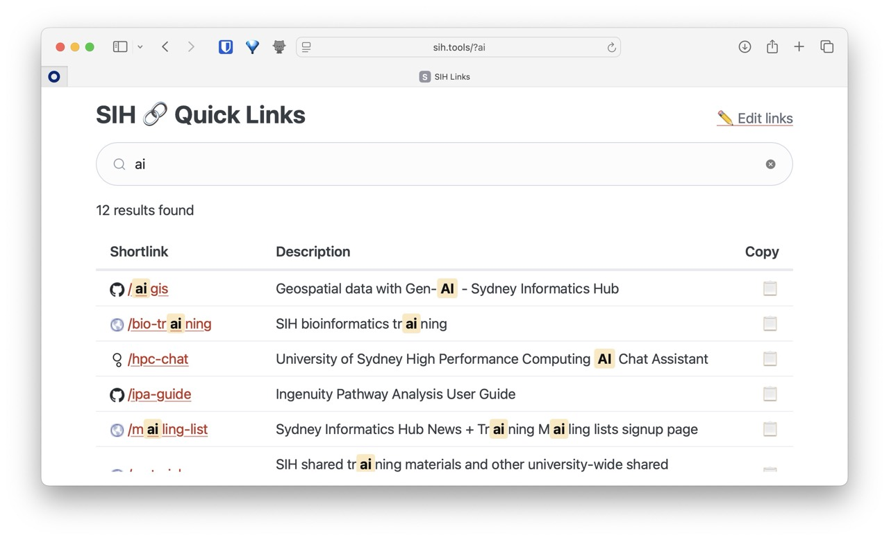

# SIH Quick Links

A minimalist URL shortener and link directory for Sydney Informatics Hub. Shortlinks redirect instantly; the index page lets you browse and search all links.



## Using shortlinks

Navigate directly to a shortlink to be redirected:

- [sih.tools/gpu](https://sih.tools/gpu) — GPU cluster information
- [sih.tools/bio](https://sih.tools/bio) — Bioinformatics resources
- [sih.tools/jira](https://sih.tools/jira) — SIH JIRA board
- [sih.tools/sharepoint](https://sih.tools/sharepoint) — SIH Sharepoint documents

## Searching the directory

Visit [sih.tools](https://sih.tools) to browse all links. Search supports fuzzy matching and separator-insensitive queries (e.g. "gpu doc", "gpu-doc", and "gpudoc" all find `gpu/docs`). Search is powered by [MiniSearch](https://github.com/lucaong/minisearch) by Luca Ongaro (MIT licence), self-hosted in `minisearch.js`.

You can pre-filter the search by appending a query param:

- [sih.tools?bio](https://sih.tools?bio) — shows all links matching "bio"
- [sih.tools?ai](https://sih.tools?ai) — shows all links matching "ai"
- [sih.tools?gpu](https://sih.tools?gpu) — shows all links matching "gpu"

## QR codes

Every link in the directory has a QR code button. Clicking it generates a QR code for the shortlink on the spot (no external service — generated locally in the browser using the [Nayuki QR Code generator](https://www.nayuki.io/page/qr-code-generator-library) in file `qrcodegen.js`).

From the popup you can:
- **Copy** — copies the QR code as a PNG image to your clipboard
- **Download** — saves it as a PNG named `qr_sih_tools_<shortcut>.png`

## Analytics

Usage metrics are collected via GoatCounter and viewable at [sih.goatcounter.com](https://sih.goatcounter.com/).

## Adding a shortlink

Edit [links.js](links.js) and add an entry to the `REDIRECTS` object:

```js
// Simple redirect
"shortcut": "https://example.com",

// With a description
"shortcut": { url: "https://example.com", description: "What this link is" },
```

The shortlink will be live at `sih.tools/shortcut` as soon as the change is merged.

> **Note:** Every entry in the object must be followed by a comma, including the one before your new entry. Missing commas will break all redirects.

Shortlinks can be hierarchical — slashes in the key create nested URLs:

```js
"gpu": { url: "...", description: "GPU cluster overview" },
"gpu/docs": { url: "...", description: "GPU cluster documentation" },
"gpu/onboarding": { url: "...", description: "GPU cluster onboarding" },
```

This gives you `sih.tools/gpu`, `sih.tools/gpu/docs`, `sih.tools/gpu/onboarding`, etc. The hierarchy is just a naming convention in the key — each entry is still an independent redirect.

## Want to use this somewhere else?

Fork a copy of [Jinx](https://jinx.fyi)
